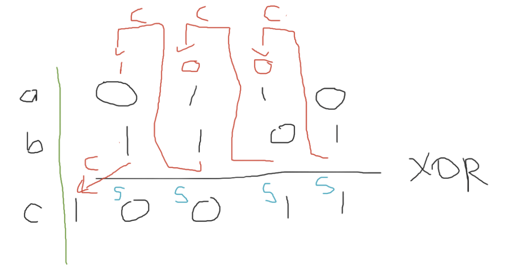

# Binary Addition

This time, we will only focus on sum of two non-negative decimals in binary format.
An example that I'm gonna show is the basic binary addition by using a Carry Ripple Adder.

It works as follows.

The operation is performed bit-by-bit (bitwise).
There are two outputs for each operation at each bit location, namely `s` for sum and `c` for carry.
The carry bit is forwarded to the next bit location, sometimes denoted as `cout`.
From the perspective of the next bit location, it is called `cin`.
Especially for the LSB operation, the carry input is 0.
Due to this carry bit is being rippled to the next bit location, it is called Carry Ripple Adder.
There is a block diagram that better illustrates it.


In order to derive the equation for `s_i` we can use the fact that `s_i` is always the product of `XOR` operation to `a_i`, `b_i`, `cin`/`c_i` (depending on which bit position you are at).
Namely,

$s_i = a_i\ \text{XOR}\ b_i\ \text{XOR}\ c_i$

Deriving the carry output bit is bit tricky to explain.
The go-to-solution is to first create a truth table like the following.
```
| a | b | cin | cout |
|---|---|-----|------|
| 0 | 0 | 0   | 0    |
| 0 | 0 | 1   | 0    |
| 0 | 1 | 0   | 0    |
| 0 | 1 | 1   | 1    | --> NOT a AND b AND cin
| 1 | 0 | 0   | 0    |
| 1 | 0 | 1   | 1    | --> a AND NOT b AND cin
| 1 | 1 | 0   | 1    | --> a AND b AND NOT cin
| 1 | 1 | 1   | 1    | --> a AND b AND cin
```

Then, you focus on the rows where `cout` is `1`. Therefore, 
```
cout = (NOT a AND b AND cin) OR (a AND NOT b AND cin) OR (a AND b AND NOT cin) OR (a AND b AND cin)
```
# Prerequisite

1. Try [04-include-library](https://github.com/MATH6183001-Scientific-Computing-2210/basic-compilation-using-gcc/tree/main/04-include-library)
2. Learn pointers [04-pointers](https://github.com/MATH6183001-Scientific-Computing-2210/basic-c/tree/main/04-pointers)

# How to

Run: 
```sh
make; ./main.out
```

Output:
```
gcc -Wall -c utils/myutils.c -o myutils.o 
gcc -Wall -c my_cra/my_cra.c -o my_cra.o -I.
gcc -Wall -c main.c -o main.o
gcc -o main.out main.o myutils.o my_cra.o -lm
Time elapsed: 0.360754 s
```

Just make sure that there is no error message.